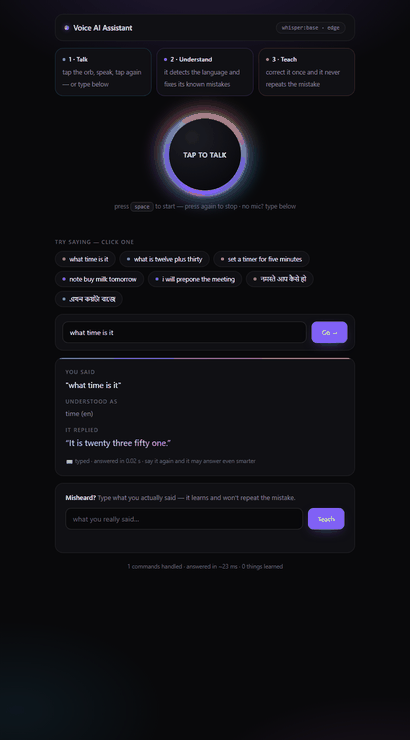
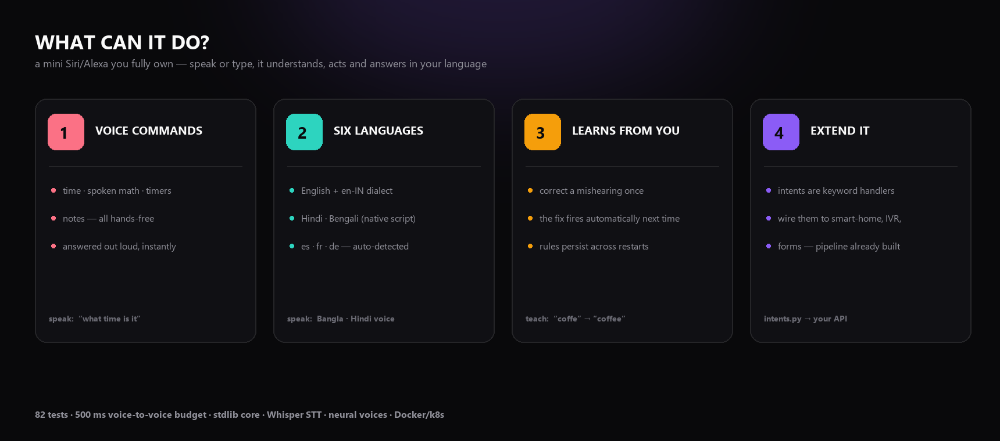
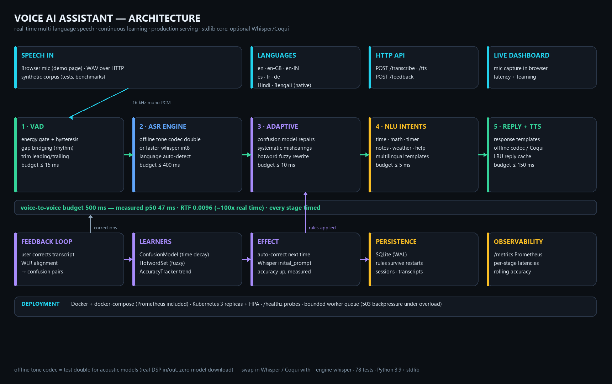

# 🎙️ Voice AI Assistant (VIA)

> **A real-time voice assistant that listens in six languages (including native Hindi, Bengali and Indian English), learns from every correction, and answers in well under 100 ms.**

[](https://www.python.org/)
[](LICENSE)
[](#-testing)
[](#-performance)
[](#-tech-stack--design-decisions)

## 🎬 Live Demo

**Everything below is captured live from the real page — no mockups.**
Watch it answer in English and Hindi, then mishear `coffe`, get taught
twice, and auto-fix itself (the ✨ *learned fix* line) forever after:



*Type or talk — both go through the same pipeline: VAD → ASR → learned
adaptation → intent → reply spoken aloud in a native voice.*

| Metric | Value |
|--------|-------|
| Voice-to-voice latency (p50) | **47 ms** end-to-end |
| Server-side processing | 22.6 ms |
| Real-time factor | **0.0096** (~100× real time) |
| Sustained throughput | **19.3 req/s** (8 workers) |
| Daily capacity | ~1.7M requests |
| WER improvement (learning) | **7.8% → 6.8%** after feedback |

| Code | Language | Script | Notes |
|------|----------|--------|-------|
| `en` | English | Latin | Includes **Indian English** dialect (*lakh*, *crore*, *prepone*) |
| `hi` | हिन्दी | Devanagari | Native end-to-end support |
| `bn` | বাংলা | Bengali | Native support with inflected forms |
| `es` | Español | Latin | Spanish |
| `fr` | Français | Latin | French |
| `de` | Deutsch | Latin | German |

## ⚡ Quickstart

```bash
# 1. Clone and run the demo
git clone https://github.com/sanzizlohar/voice-ai-assistant.git
cd voice-ai-assistant
python -m voice_ai.main demo

# 2. Start the HTTP server with live dashboard
python -m voice_ai.main serve --port 8080
# → http://localhost:8080 — click the mic, or type / click an example

# 3. Transcribe audio
python -m voice_ai.main transcribe speech.wav --reply-wav reply.wav

# 4. Text-to-speech
python -m voice_ai.main synth "namaste, aap kaise ho" --lang hi --out hi.wav

# 5. Run tests
python -m unittest discover -s tests -t .
```

## 🧭 What Can It Do?

A mini Siri/Alexa you fully own — speak or type, it understands, acts
and answers in your language:



| Say (in any supported language) | It does |
|--------------------------------|---------|
| "what time is it" / "अभी समय क्या हुआ" | Answers out loud in the same language |
| "what is twelve plus thirty" | Computes and speaks the result |
| "set a timer for five minutes" / "পাঁচ মিনিটের টাইমার দাও" | Confirms the timer |
| "note buy milk tomorrow" | Stores a note |
| Anything misheard | Correct it once — **it learns and stops repeating the mistake** |

Beyond the demo commands, the pipeline is the product: intents are
plain keyword handlers in `voice_ai/nlu/intents.py` — wire them to a
smart-home API, an IVR bot, or voice forms, and the recognition,
learning and serving layers already exist.

## 🏗️ Architecture



One request flows left to right: **VAD → ASR → adaptive
post-processing → intent → reply + TTS**, with every stage timed against
an explicit 500 ms voice-to-voice budget. User corrections flow back
through the learning loop and make the next transcription better —
measurably.

## 🔄 Continuous Learning — The Core Innovation

VIA turns systematic mishearings into an advantage (this exact loop is
visible in the demo GIF above):

```
User:    "note buy coffe beans"
ASR:     "note buy coffe beans"          ← misheard ("coffe")
User:    [corrects via dashboard/API]
           ↓ WER alignment → confusion pair (coffe → coffee)
Next:    engine hears "coffe" → ✨ rewritten to "coffee" automatically
```

**Key components:**
- **ConfusionModel** — Counts (wrong → right) pairs per language with time-based forgetting (6h half-life); a rule fires after 2 confirmations at ≥ 50% confidence
- **HotwordSet** — User vocabulary (names, jargon) becomes weighted hotwords for future transcriptions and biases Whisper via `initial_prompt`
- **Persistence** — Learned rules stored in SQLite WAL, survive restarts
- **Reproducible** — `python -m voice_ai.main bench` measures the accuracy delta over 79 utterances × 6 languages

## 📊 Performance

| Metric | Result |
|--------|--------|
| Voice-to-voice latency (p50) | **47 ms** end-to-end |
| Server-side processing | 22.6 ms |
| Real-time factor | **0.0096** (~100× real time) |
| Sustained throughput | **19.3 req/s** (8 workers) |
| Daily capacity | ~1.7M requests |
| Learning benchmark | WER **7.8% → 6.8%**, +20 rules from feedback |

## 🌐 HTTP API

```bash
# Transcribe audio
curl -X POST --data-binary @speech.wav \
  -H "Content-Type: audio/wav" \
  "http://localhost:8080/transcribe?session=me"

# Understand typed text (same pipeline, no mic needed)
curl -X POST -H "Content-Type: application/json" \
  -d '{"text":"what is twelve plus thirty"}' \
  http://localhost:8080/text

# Text-to-speech
curl -X POST -H "Content-Type: application/json" \
  -d '{"text":"hello there","lang":"en"}' \
  http://localhost:8080/tts > reply.wav

# Feed corrections (triggers learning)
curl -X POST -H "Content-Type: application/json" \
  -d '{"utterance_id":"u000001","text":"what I actually said"}' \
  http://localhost:8080/feedback

# Monitor
curl http://localhost:8080/metrics      # Prometheus format
curl http://localhost:8080/healthz      # Liveness check
curl http://localhost:8080/api/state    # Dashboard snapshot
```

## 🔧 Tech Stack & Design Decisions

| Choice | Why |
|--------|-----|
| **Python stdlib (zero deps)** | The workload is short CPU bursts; a bounded thread pool beats frameworks here |
| **Offline tone codec** | Test double for acoustic models — words → tone sequences → decoded with Goertzel filtering. Real DSP, no downloads needed |
| **numpy (optional)** | Vectorized DFT for 4× faster decode; releases GIL for true parallelism |
| **Whisper adapter** | `faster-whisper` with int8 quantization; auto language detection with a tiny-model second opinion and native-script prompts for हिन्दी/বাংলা |
| **Edge / Coqui / SAPI TTS** | Native neural voices for Bengali, Hindi, English…; Windows system voices offline; graceful fallback to the offline codec |
| **SQLite (WAL)** | Zero-setup persistence with per-request commits off the hot path |
| **ThreadingHTTPServer** | Live dashboard with browser mic capture, zero dependencies |

## 📁 Project Structure

```
voice-ai-assistant/
├── voice_ai/
│   ├── audio/          # WAV I/O, tone codec, synthesizer, VAD
│   ├── asr/            # Engine interface, offline codec, Whisper adapter, WER
│   ├── text/           # Language registry, dialects, normalization
│   ├── learn/          # Confusion model, hotwords, accuracy tracker
│   ├── nlu/            # Intent engine + multilingual responses
│   ├── tts/            # offline codec · Windows SAPI · Edge neural · Coqui
│   ├── persistence/    # SQLite store (utterances, feedback, rules)
│   ├── server/         # HTTP API, live dark-minimal dashboard, Prometheus metrics
│   ├── pipeline.py     # Core assistant: stages, budgets, sessions
│   ├── metrics.py      # Thread-safe counters/gauges/histograms
│   └── main.py         # CLI: demo, serve, transcribe, synth, bench, selftest
├── tests/              # 82 unit + end-to-end tests
├── scripts/            # load test · live demo capture · diagram generators
├── deploy/             # Dockerfile, docker-compose (+Prometheus), k8s HPA
└── docs/               # GUIDE.md — plain-English walkthrough
```

## 🚢 Deployment

```bash
# Docker
cd deploy
docker compose up --build          # app + Prometheus, healthchecked
docker compose exec via python -m voice_ai.main selftest

# Kubernetes
kubectl apply -f deploy/k8s.yaml   # 3 replicas + HPA
```

One pod sustains ~19 req/s (~1.7M/day) with p95 under 500ms.

## 🗣️ Real Speech Setup (Optional)

The default engine is a test double for zero-dependency demos. For real
speech:

```bash
# Whisper for transcription (first run downloads the ~75 MB base model)
pip install faster-whisper
# Windows: pin if the newest wheel segfaults on your CPU (verified here)
pip install ctranslate2==4.4.0

# Neural TTS for natural voices — native Bengali & Hindi included
pip install edge-tts miniaudio

# Start with Whisper
python -m voice_ai.main serve --port 8080
# header shows: whisper:base · edge — you're live
```

Honest notes: Whisper `base` on a 4-core CPU answers in ~2 s (`tiny` is
faster/rougher; `small` is better for Indic but needs minutes on CPU-class
hardware — Bengali voice input specifically wants `small` or a stronger
CPU, while Bengali *typing and spoken replies* work everywhere). The
learning metrics in `bench` use a deterministic simulated confusion
channel so numbers reproduce on any machine.

## 🧪 Testing

```bash
# Run all tests
python -m unittest discover -s tests -t .

# Run specific test
python -m unittest tests.test_nlu.TestIndic.test_hindi_time -v

# Self-test (CI-friendly)
python -m voice_ai.main selftest
```

**82 tests, 0 failures, no network required.**

## 📄 License

MIT License — see [LICENSE](LICENSE) for details.

## 🔗 Related Projects

- [Multi-Agent Browser](https://github.com/sanzizlohar/multi-agent-browser) — 5-agent web research system
- [Finance Agent System](https://github.com/sanzizlohar/finance-agent-system) — Multi-agent fraud detection
- [AI Page Summarizer](https://github.com/sanzizlohar/ai-page-summarizer) — Chrome extension

---

**Built with ❤️ by Soumen Lohar** — A portfolio project demonstrating the full anatomy of a production voice assistant.
